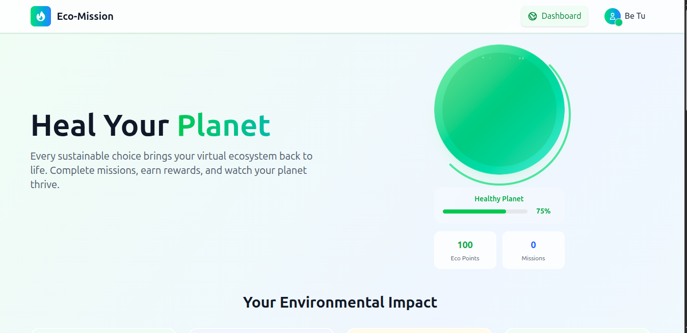

## Eco-Mission
Gamifying Sustainable Energy for the Next Generation

Eco-Mission turns responsible energy consumption into an engaging game where users nurture a virtual planet through real-world sustainable actions. Built for Green Wells Energies Hackathon.

[Try the Live Demo](https://wonderful-kheer-29f173.netlify.app/login)
## What is Eco-Mission?
Eco-Mission is a mobile app that addresses the engagement gap in sustainable energy by making eco-friendly habits fun and rewarding. Users manage a virtual planet whose health directly reflects their real-world energy choices with Green Wells Energies.

# Core Gameplay Loop:
1. Virtual Planet - Personalized ecosystem that visually responds to user behavior
2. Real-World Missions - Complete tasks like cylinder returns, eco-deliveries, and safety quizzes
3. Progress Tracking - Animated analytics showing environmental impact
4. Social Features - Connect with friends and compare planet health
# Features
- Dynamic Planet Ecosystem with real-time health indicators
- Mission System with QR scanning, delivery optimization, and safety education
- Beautiful Notifications with progress tracking
- Responsive Design that works perfectly on all devices
- Smooth Animations for percentages and progress tracking
- Social Gamification with friend referrals and connected planets

# Tech Stack
*Frontend:*
1. React + Vite
2. Tailwind CSS 4
3. Responsive Design
4. Custom Animations

*Backend:*
1. Node.js + Express
2. MongoDB
3. RESTful APIs

# Installation
```bash
# Clone the repository
git clone https://github.com/bethwel3001/Eco-mission.git

# Install dependencies
pnpm install

# Start development server
pnpm dev

# Build for production
pnpm build
```
#  How It Works
1. Sign Up - Create your account and get your virtual planet
2. Complete Missions - Scan QR codes, choose eco-deliveries, take safety quizzes
3. Heal Your Planet - Watch your planet thrive as you make sustainable choices
4. Track Progress - See your environmental impact with beautiful analytics
5. Connect with Friends - Invite others and build a sustainable community

# Made with passion by Be Tu, powered by ambition. (:


